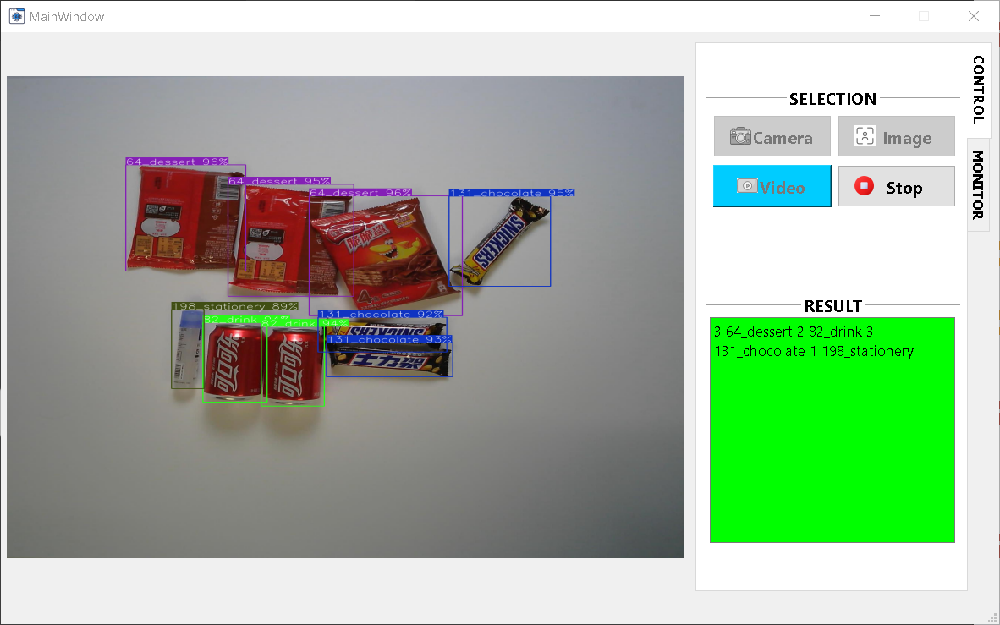

# visionretail
This project is used for the purpose of indentifying different items in the retail sector using vision retail.Specifically, this automated checkout system uses Computer Vision, AI and IoT sensors to identify products, track costumers and automatically process transactions without using traditional checkout system.
## YouTube link
[Xem video hướng dẫn tại đây](https://www.youtube.com/watch?v=Zal1Ds5ADqs)
## UI app

# Python version: 3.9.21
# Installation guide 
It is recommended to create a virtual environment with [conda](https://docs.conda.io/projects/conda/en/latest/user-guide/install/index.html):
```console
conda create -n ai_product_identification python=3.9.21
```
And activate it:
```console
conda activate ai_product_identification
```
Install dependencies:
```console
pip -r requirements.txt
```
Run the application:
```console
python MainGUI.py